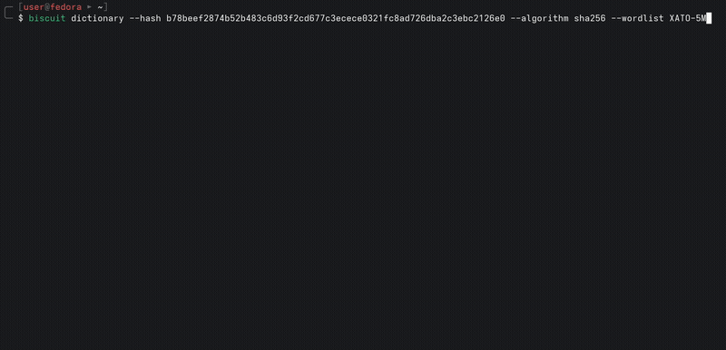

# Biscuit

**Biscuit** is an offline password hash auditing and recovery CLI tool written in Python.



## Status

Biscuit is currently **WIP**.

| Feature            | Status          |
| ------------------ | --------------- |
| Dictionary attack  | WIP — developed |
| Brute-force attack | WIP — developed |
| Hash generation    | WIP — developed |
| Password spraying  | Not started     |
| Salt support       | Planned         |

*Currently supporting only Linux.*

## Modes

### Dictionary Attack

Test passwords from a wordlist against a target hash.

Syntax example:
```
biscuit dictionary --hash 660f2dd5a2e102002a444e862b511ac51a4dc6636a46edba79d62037c738b9f2 --algorithm sha256
```

Supports built-in wordlists and external wordlist files.

### Brute-force Attack

Generate and test password candidates across a defined keyspace.

Syntax example:
```
biscuit brute-force --hash 660f2dd5a2e102002a444e862b511ac51a4dc6636a46edba79d62037c738b9f2 --algorithm sha256 --charset alphanumeric --min-length 4 --max-length 8
```

### Hash Generation

Generate a hash from a given password and algorithm.

Syntax example:
```
biscuit hash-gen --password <PASSWORD> --algorithm sha256
```

### Password Spraying

Planned feature. Development has not started yet.

## Supported Algorithms

Currently supported:
- MD5
- SHA-1
- SHA-256
- SHA-384
- SHA-512

## Character sets

The tool uses ASCII character set by default.

Currently supported:
- lowercase
- uppercase
- digits
- letters
- alphanumeric
- special
- all

## Installation

Clone the repository and install Biscuit with pip:

```
git clone https://github.com/vel4tus/biscuit-password-auditing.git
cd biscuit-password-auditing
pip install -e .
```

After installation:

```
biscuit --help
```

## Usage

Get general help:

```
biscuit --help
```

Get help for a specific mode:

```
biscuit dictionary --help
biscuit brute-force --help
biscuit hash-gen --help
```

## Authorized use only

Biscuit is intended for **authorized security auditing, password recovery, and educational purposes only**.

Do not use it against systems, accounts, or password hashes without explicit authorization.
